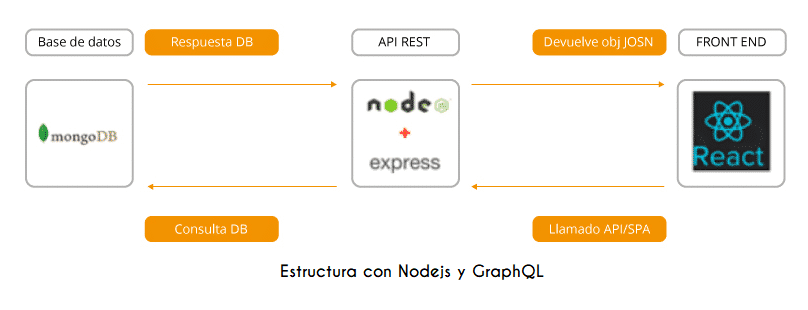

# EQUIPO RETREADS
Desarrollo del proyecto de emprendimiento Ciclo 4 MisionTic2022

 

## INTEGRANTES
1. Desarrollador: Iwinser Aljadys Sanchez <iwinser.sanchez47@gmail.com> CC 1122730507
2. Analista:Alejandra Aguilar Gómez aleja.vale12@gmail.com CC 52854936
3. Product owner: Jonathan Manuel Llanos ruiz <jomallaru@gmail.com>, C.C 1117498826
4. Administrador de BD: William Felipe Naranjo Polania
5. Scrum master: Nestor Guillermo Jiménez Peña, njimenez@ipconecta.com.co, CC.17417536     

## DESCRIPCION DEL PROYECTO - CONTEXTO DEL NEGOCIO 
- Proyecto por desarrollar:  WEB para un restaurante de comidas Rapidas
- Nombre del Proyecto: MIXTO'S
- Arquitectura de la aplicación web:

 

## MODULOS: 
la aplicación web contara con los siguientes módulos:
- Módulo de gestión de usuarios
- Módulo de inventario
- Módulo de ventas
- Módulo de pagos

## HERRAMIENTAS:
Herramientas para organizar, planear, estructurar y desarrollar la aplicación web:
- Git
- Github
- Trello
- Docker
- Stark tecnologico: Plataforma en la Nube (Docker Hub ó Heroku)
- Lenguaje JavaScript
- Mongo DB y MongoDb Atlas
- Node.Js
- Express
- React JS

## MODELO MOCKUPS

## DIAGRAMA UML

## COMMIT DE PRUEBAS
- hola, soy iwinser sanchez.
- Este es un commit de Jonathan llanos.
- Hola soy Aleja...ya estoy aquí!. 
- Hola soy Nestor,aqui ajustando el README.
